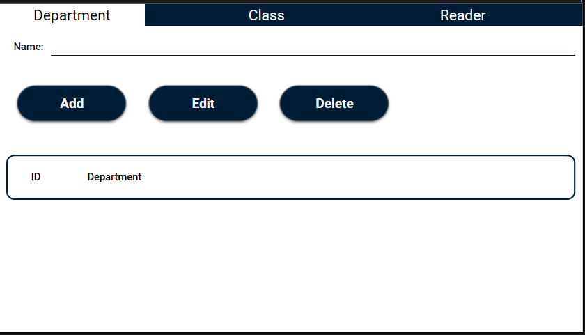
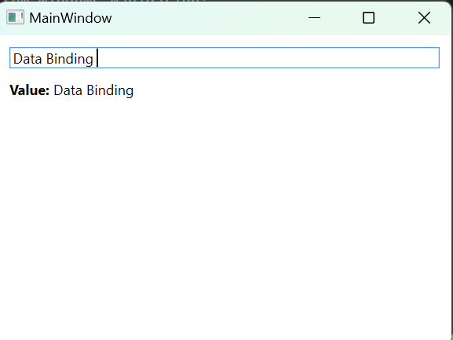
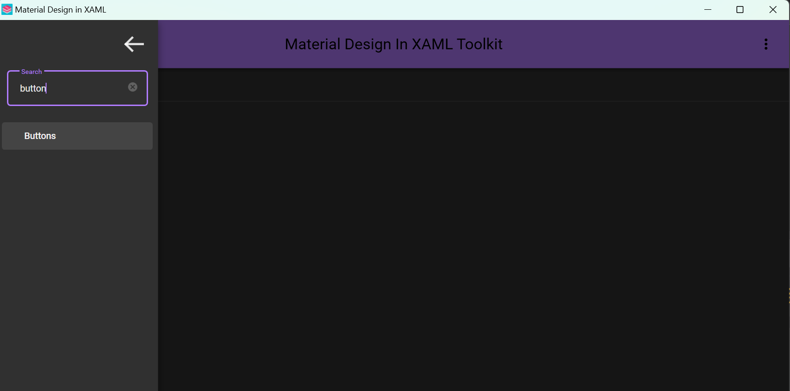

Mô hình Project Desktop App mẫu của Viamlab được tạo nên trên cơ sở mô hình MVVM (Model - View - ViewModel) và Orion Achitecture. Mô hình giúp người phát triển app dễ dàng triển khai cũng như chỉnh sửa project vì các thành phần được phát triển độc lập với nhau. Vậy cùng tìm hiểu cách để tạo 1 project chuẩn nhé! <3
## Mục lục
 I, Giới thiệu về các thành phần chính của project
	1, Khái quát các thành phần và chức năng của chúng
	2, Cách tạo project Desktop App bằng Visual Studio
II, Thiết kế giao diện (View)
	1, Giới thiệu về XAML và cách sử dụng một số thành phần đối tượng cơ bản
	2, Hướng dẫn cài đặt và sử dụng Material Degisn In XAML
	3, Hướng dẫn tạo Resource cho các thành phần trong View
III, Tạo Model và lấy dữ liệu từ API
	1, Tạo Model cho ứng dụng
	2, Tạo Dtos để nhận dữ liệu từ API
	3, Dùng HttpClient truy vấn và đưa dữ liệu từ API vào Model
IV, Lập trình các chứng năng cho giao diện (ViewModel)
	1, Dependency Injection
	2, Áp dụng Dependency Injection vào lập trình ViewModel
	3, Thực hành lập trình một số chức năng cơ bản cho ứng dụng

# I, Giới thiệu về các thành phần chính của project
## 1, Khái quát các thành phần và chức năng của chúng
   Một project desktop app trong Viamlab được thiết kế dựa trên mô hình MVVM nên sẽ có 3 thành phần chính:  phần giao diện của ứng dụng(View), các đối tượng truy xuất và thao tác trên dữ liệu (Model), và phần giúp thực hiện các chức năng cho ứng dụng (ViewModel).
   - View: được hiểu là thành phần giao diện mô tả dữ liệu của một ứng dụng, đồng thời đây cũng là thành phần duy nhất cho phép người dùng tương tác trong chương trình. Giao diện được thiết kế bằng ngôn ngữ đánh dấu khai báo XAML (sẽ được tìm hiểu kỹ hơn trong phần thiết kế giao diện). 
   - Model: là các đối tượng được tạo ra để thao tác với dữ liệu của ứng dụng.
   - Viewmodel: là lớp trung gian giữa View và Model. ViewModel sẽ đảm nhận công việc đồng bộ dữ liệu từ Model lên View và thực hiện các thao tác người dùng lên View bằng việc sử dụng Data Binding. Một View có thể chứa nhiều ViewModel và một ViewModel có thể được ánh xạ từ nhiều View thì trong mô hình MVVM, các tầng bên dưới sẽ không biết được các thông tin gì về các tầng trên của nó.
   Cấu trúc thư mục của 1 project:
   
  Đây là cấu trúc thư mục của một project Desktop App của Viamlab. Nhìn vào thì chúng ta có thể thấy project gồm 2 phần chính. Phần thứ nhất (TD.WareHouse.DemoApp) dùng để chứa các giao diện của ứng dụng. Toàn bộ giao diện sẽ được thiết kế vào trong phần này, sẽ không có 1 dòng code behind nào ở trong phần thứ nhất. Phần thứ 2(TD.WareHouse.DemoApp.Core) dùng để chứa các Model, ViewModel và các dịch vụ khác. Ngược lại với phần thứ nhất, phần này chỉ chứa code mà không có gì liên quan đến thiết kế giao diện. Việc tách riêng biệt từng phần của project như này sẽ giúp việc thiết kế, chỉnh sửa và phát triển phần mềm trở nên dễ dàng hơn. Phần thứ 2 sẽ được liên kết với phần thứ nhất bằng việc sử dụng kỹ thuật Dependency Injection (sẽ được đề cập ở phần sau).
## 2, Cách tạo project Desktop App bằng Visual Studio
   Visual Studio là một công cụ hỗ trợ việc thiết kế Desktop App cực kỳ mạnh mẽ và hiệu quả. Phần mềm này cung cấp công cụ cho việc thiết kế giao diện trở nên trực quan qua từng dòng code. Phần mềm còn hỗ trợ việc nhắc code, khả năng gỡ rối (Debug) hiệu quả và dễ dàng thông qua việc chày từng câu lệnh và theo dõi dự thay đổi trạng thái của chương trình.
   Chúng ta hãy cũng tìm hiểu các bước để tạo một project Desktop App bằng Visual Studio.
   Bước 1: Mở phần mềm Visual Studio, chúng ta sẽ thấy giao diện phần mềm như bên dưới. Nhấp chọn vào "Creat a new project".
   
   Bước 2: Vào thanh tìm kiếm, tìm kiếm từ khóa "WPF App". Nhấp chọn vào "WPF App(.NET Framework)" rồi ấn "Next".
   
   Bước 3: Đặt tên do project của bạn và nhấp vào ô "..." bên cạnh "Location" để chọn nơi lưu cho Project. Sau khi đặt tên và chọn xong nơi lưu thì ấn "Next"
   
   Sau khi nhấn "Next" giao diện của project sẽ hiện ra như sau:
   
   Vậy là chúng ta đã tạo thành công 1 project Desktop App bằng Visual Studio. Ở phần tiếp theo, chúng ta sẽ tìm hiểu cách để thiết kế giao diện cho project trên.
# II, Thiết kế giao diện(View)
## 1, Giới thiệu về XAML và cách sử dụng một số thành phần đối tượng cơ bản
#### XAML là gì?
XAML là một ngôn ngữ đánh dấu khai báo. Khi được áp dụng cho mô hình lập trình .NET Core, XAML thì nó đơn giản hóa việc tạo giao diện người dùng (UI) cho ứng dụng .NET Core. Bạn có thể tạo các thành phần UI có thể nhìn thấy trong đánh dấu XAML khai báo, sau đó tách định nghĩa UI khỏi logic thời gian chạy bằng cách sử dụng code-behind nối với đánh dấu (markup) thông qua các định nghĩa lớp một phần. XAML trực tiếp đại diện cho việc khởi tạo các đối tượng trong một tập hợp các kiểu sao lưu cụ thể được xác định trong các cụm. Điều này không giống như hầu hết các ngôn ngữ đánh dấu khác, thường là ngôn ngữ được dịch mà không có sự ràng buộc trực tiếp như vậy với hệ thống loại sao lưu. XAML cho phép một quy trình làm việc trong đó các bên riêng biệt có thể làm việc trên UI và logic của ứng dụng, sử dụng các công cụ có khả năng khác nhau.
#### Các thành phần đối tượng trong XAML
Một phần tử đối tượng thường khai báo một thể hiện của một loại. Loại đó được xác định trong các thành phần nắp ghép mà được tham chiếu bởi ngôn ngữ XAML . Một thành phần đối đối tượng trong trong XAML luôn bắt đầu bằng dấu `<` và kết thúc bằng dấu `/>` hoặc là `<ten_object` và kết thúc bằng dấu `</ten_object>` . Trong giữa dấu bắt đầu và kết thúc ta có thể khai báo tên đối tượng, sử dụng các trường hay khai báo thêm các đối tượng con trong đó ... Ví dụ:
```XML
<Grid Name = "mainGrid">
	<Button Content = "Click Me" />
</Grid>
```

### Một số thành phần đối tượng cơ bản trong XAML
#### TextBlock
   **TextBlock** Control là một trong những control cơ bản nhất của WPF, nó rất hữu ích. Nó cho phép bạn hiển thị văn bản trên màn hình. Cùng xem ví dụ sau để hiểu hơn:
   ```xml 
   <Grid>
    <TextBlock Text="VIAMLAB" FontSize="50" Foreground="Red"
     Width=" 250" Height="150" Background="Gainsboro"/>
   </Grid>
```

   Trong trường hợp văn bản dài và cần xuống dòng, bạn có thể sử dụng thuộc tính  `TextWrapping = ''Wrap"`để xuống dòng. 
```xml
<Grid>
    <TextBlock Text="Văn bản này rất dài và textblock này không đủ diện tích để chứa hết trên 1 dòng." TextWrapping="Wrap"
     FontSize="20" Background="Gainsboro" Foreground="Red" Width=" 250" Height="150"/>
</Grid>
```

#### TextBox
   TextBox là control cơ bản nhất để nhập liệu trong WPF, cho phép người dùng nhập văn bản thuần ,hoặc là trên cùng 1 dòng, hoặc cho đối thoại, hoặc trên nhiều dòng như trình soạn thảo.
   TextBox control là 1 thứ quá phố biến đến mức bạn không cần bất kỳ thuộc tính nào để có thể tạo ra 1 trường nhập liệu với đủ tính năng. Sau đây là 1 ví dụ cơ bản:
```xml
<TextBox Width="200" Height="50"/>
```

   Đó là tất cả những gì bạn cần để có một trường nhập chuỗi ký tự. Tôi đã thêm chuỗi ký tự vào TextBox sau khi chạy ví dụ và chụp màn hình, nhưng bạn cũng có thể thực hiện nó thông qua việc khai báo bằng cách sử dụng thuộc tính Text để điền nội dung trước khi chạy.
```xml
<TextBox Text = "Hello World!" Width="200" Height="50"/>
```
   Nếu bạn chạy ví dụ trên, bạn sẽ thấy TextBox mặc định là 1 dòng, sẽ chẳng có gì xảy ra khi bạn nhấn Enter hay là bạn nhập nhiều ký tự hơn, khi đó dòng chỉ cuộn ngang. Tuy nhiên, để tạo 1 TextBox trên nhiều dòng thì rất đơn giản:
```xml
<TextBox AcceptsReturn="True" TextWrapping="Wrap" Width="200" Height="Auto"/>
```

   Thuộc tính AcceptsReturn cho phép TextBox thành 1 control nhiều dòng bằng cách nhấn Enter. Thuộc tính TextWrapping thì tương tự như TextBlock, nó cho phép văn bản tự xuống dòng khi đến cuối hàng.
#### Button
   Không có framework về giao diện nào lại thiết button, giống như tên gọi của nó, nó là một nút nhấn dùng để xử lý một việc vào đó bằng event Click. Để tạo ta một button, giống như các control khác, ta cần thêm 1 button tag như sau:
```xml
<Button>Click</Button>
```
   Nội dung của button có thể được đặt bằng cách đặt text giữa các tag hoặc sử dụng thuộc tính Content của Button. Ở ví dụ trên, chúng ra đã sử dụng cách thứ nhất để đặt nội dung cho Button. 
   Mỗi Button đều thực hiện mội chức năng nào đó khi được nhấn vào. Chức năng đó được lập trình thông qua event Click của Button. Để tạo ra event Click, cách đơn giản nhất là đúp chuột trái vào Button, một event sẽ được tự động khởi tạo ở trong code behind của giao diện. Hoặc chúng ta cũng có thể khai báo event Click trong thuộc tính của Button.
```xml
<Button Content="Nhấn" Click="Button_Click" Width="100" Height="50" ></Button>
```

   Ở trong phần code behind sẽ xuất hiện một event như sau:

   Chúng ta sẽ lập trình chức năng mong muốn khi thực hiện nhấn Button vào trong event này.
   Đó là cách dùng đơn giản của Button, nhưng trong mô hình MVVM đòi hỏi việc giao diện và code phải độc lập với nhau nên chúng ta sẽ không dùng cách này. Thay vào đó, ta sẽ sử dụng Command để khai báo event cho Button, event này sẽ được khai báo lại và xử lý trong phần ViewModel. Cụ thể sử dụng như thế nào thì trong phần Command và ViewModel sẽ có những ví dụ cụ thể hơn để các bạn nắm rõ.
#### Grid
   Grid là thành phần cơ bản nhất trong một giao diện WPF, sau khi tạo xong project, Grid là đối tượng đầu tiên xuất hiện trong phần code giao diện. Có thể hiểu Grid là một vùng mà trong vùng đó ta có thể chứa các control khác như textbox, texblock, button, checkbox, image, ... 
   Ta có thể chia 1 Grid thành nhiều phần (nhiều hàng, nhiều cột) bằng cách sử dụng cặp thẻ `<Grid.RowDefinitions></Grid.RowDefinitions>` để chia Grid thành nhiều hàng và `<Grid.ColumDefinitions></Grid.ColumDefinitions>` để chia Grid thành nhiều cột. Để dễ hiểu hơn, chúng ta cùng làm một ví dụ sau đây:
```xml
<Grid.RowDefinitions>
    <RowDefinition Height="40"></RowDefinition>
    <RowDefinition Height="50"></RowDefinition>
    <RowDefinition Height="100"></RowDefinition>
    <RowDefinition Height="50*"></RowDefinition>
</Grid.RowDefinitions>
<Grid.ColumnDefinitions>
    <ColumnDefinition Width="40"></ColumnDefinition>
    <ColumnDefinition Width="50"></ColumnDefinition>
    <ColumnDefinition Width="40"></ColumnDefinition>
    <ColumnDefinition Width="50*"></ColumnDefinition>
</Grid.ColumnDefinitions>
<Button Name="Button1" Content="Button1" Grid.Row="0" Grid.Column="0"/>
<Button Name="Button2" Content="Button2" Grid.Row="2" Grid.Column="0" Grid.RowSpan="3"/>
<Button Name="Button3" Content="Button3" Grid.Row="0" Grid.Column="2"/>
<Button Name="Button4" Content="Button4" Grid.Row="3" Grid.Column="3" Grid.RowSpan="2"/>
```


#### WrapPanel
   WrapPanel sẽ định vị từng child control của nó bên cạnh nhau, theo chiều ngang (mặc định) hoặc theo chiều dọc, cho đến khi không còn chỗ, nơi nó sẽ chuyến đến dòng tiếp theo và sau đó tiếp tục. Sử dụng nó khi bạn muốn một danh sách các control dọc hoặc ngang tự động kết thúc khi không còn chỗ.
   Khi WrapPanel sử dụng theo hướng Ngang, các điều khiển con sẽ có cùng chiều cao, dựa trên mục cao nhất. Khi WrapPanel theo hướng dọc, các điều khiển con sẽ được cung cấp cùng chiều rộng, dựa trên mục rộng nhất.
   Cùng xem 2 ví dụ sau để hiểu hơn về WrapPanel trong 2 trường hợp Ngang và Dọc.
```xml
<WrapPanel> 
	<Button>Test button 1</Button>
	<Button>Test button 2</Button>
	<Button>Test button 3</Button>
	<Button Height="40">Test button 4</Button>
	<Button>Test button 5</Button>
	<Button>Test button 6</Button>
</WrapPanel>
```

```xml
 <WrapPanel Orientation="Vertical">
     <Button>Test button 1</Button>
     <Button>Test button 2</Button>
     <Button>Test button 3</Button>
     <Button Width="140">Test button 4</Button>
     <Button>Test button 5</Button>
     <Button>Test button 6</Button>
 </WrapPanel>
```


#### StackPanel
   StackPanel rất giống với WrapPanel, nhưng có ít nhất một điểm khác biệt quan trọng: StackPanel không bao bọc nội dung. Thay vào đó, nó kéo dài nội dung theo một hướng, cho phép bạn xếp chồng item sau và item trước lên nhau. Trước tiên chúng ta hãy thử một ví dụ đơn giản:
```xml 
<Window x:Class="WpfTutorialSamples.Panels.StackPanel" 
		xmlns="http://schemas.microsoft.com/winfx/2006/xaml/presentation" 
		xmlns:x="http://schemas.microsoft.com/winfx/2006/xaml" 
		Title="StackPanel" Height="160" Width="300">
	<StackPanel>
		<Button>Button 1</Button>
		<Button>Button 2</Button>
		<Button>Button 3</Button>
		<Button>Button 4</Button> 
		<Button>Button 5</Button> 
		<Button>Button 6</Button>
	</StackPanel> 
</Window>
```

   Bạn cũng có thể nhận thấy rằng hướng mặc định của StackPanel là Dọc, không giống như WrapPanel với hướng mặc định là Ngang. Nhưng cũng giống như đối với WrapPanel, điều này có thể dễ dàng thay đổi, bằng cách sử dụng thuộc tính Orientation:
```xml
<StackPanel Orientation="Horizontal">
```
#### Image
   Hình ảnh trong wpf cho phép bạn hiển thị hình ảnh trong ứng dụng. Đây là control có tính đa dụng cao, có thể sử dụng trong nhiều trường hợp khác nhau. 
```xml
<Image Source="C:\Users\ADMIN\OneDrive\Pictures\Screenshots\logoBKRA.png"/>
```
   Và kết quả ta nhận được là:

   Khi muốn thêm hình ảnh vào giao diện, chúng ta chỉ cần sử dụng thể Image, thêm đường dẫn của hình ảnh ở trong máy vào thuộc tính Source. Muốn chỉnh sửa kích thước, vị trí của ảnh thì ta làm tương tự các control đã giới thiệu ở trên.
   Kết quả sẽ như thế này
#### Border
   Điều khiển Đường viền (Border control) là một điều khiển Trang trí trong đó bạn có thể vẽ đường viền, phần nền phía sau (background) hoặc cả hai, xung quanh những thành phần khác. Vì các bảng WPF (WPF panels) không hỗ trợ vẽ đường viền xung quanh các cạnh của nó, điều khiển Đường viền có thể giúp bạn thực hiện điều đó, chỉ đơn giản là bọc xung quanh. Ví dụ một bảng với điều khiển Đường viền:
   Ví dụ đơn giản sau sử dụng Border control như được mô tả ở trên:
```xml
<Grid Margin="10">
   <Border Background="GhostWhite" BorderBrush="Gainsboro" BorderThickness="1">                <StackPanel Margin="10">
          <Button>Button 1</Button>
          <Button Margin="0,10">Button 2</Button> 
          <Button>Button 3</Button> 
       </StackPanel>
    </Border>
</Grid>
```

   Khung viền sẽ khá khó nhìn cho tới khi bạn xác định các giá trị màu nền, nét vẽ và độ dày và đó là những gì tôi đã làm ở đây, sử dụng các thuộc tính Background (nền phía sau của đường viền), BorderBrush (màu bên ngoài của đường viền) và BorderThickness (độ dày của đường viền). Ngoài ra, để bo tròn góc của đường viền, chúng ta sử dụng thuộc tính CornerRadius.
   
#### CheckBox
   CheckBox cho phép người dùng lựa chọn trạng thái tắt hặc mở (on or off), thường để phản ánh giá trị Boolean trong Code-behind. Hãy cùng đi thẳng vào ví dụ trong trường hợp bạn không chắc CheckBox trông ra sao:
```xml
<StackPanel>
    <CheckBox>Enable feature ABC</CheckBox>
    <CheckBox IsChecked="True">Enable feature XYZ</CheckBox>
    <CheckBox>Enable feature WWW</CheckBox>
</StackPanel>
```

   Như bạn thấy, CheckBox rất dễ dùng. Trong CheckBox thứ 2, tôi đã dùng thuộc thính IsChecked để mặc định nó được check, ngoài ra không cần sử dụng thuộc tính nào khác. Thuộc tính IsChecked cũng có thể dùng trong Code-behind nếu bạn muốn kiểm tra 1 CheckBox có được check hay không.
#### ListBox
   ListBox là một Control rất thường hay sử dụng trong XAML. ListBox dùng để hiển thị một danh sách và cho phép người dùng chọn một hoặc một số mục từ danh sách và tự động đưa ra phải hồi trực quan cho nó.
   Đây là một ví dụ về điều khiển ListBox đơn giản:
```xml
 <Grid Margin="10">
     <ListBox>
         <ListBoxItem>ListBox Item #1</ListBoxItem>
         <ListBoxItem>ListBox Item #2</ListBoxItem>
         <ListBoxItem>ListBox Item #3</ListBoxItem>
     </ListBox>
 </Grid>
```

   Chúng ta đã khai báo một ListBox và trong ListBox có 3 Item, mỗi cái có một văn bản riêng.
   Chúng ta thường sử dụng DataBinding để hiển thị dữ liệu các Item của ListBox. DataBinding sẽ được nói kỹ hơn trong phần Binding nhưng bây giờ chúng ta hãy tìm hiểu các này thông qua một ví dụ đơn giản:
```xml
 <Grid Margin="10">
     <ListBox Name="lbTodoList" HorizontalContentAlignment="Stretch">
         <ListBox.ItemTemplate>
             <DataTemplate>
                 <Grid Margin="0,2">
                     <Grid.ColumnDefinitions>
                         <ColumnDefinition Width="*" />
                         <ColumnDefinition Width="100" />
                     </Grid.ColumnDefinitions>
                     <TextBlock Text="{Binding Title}" />
                     <ProgressBar Grid.Column="1" Minimum="0" Maximum="100" 
                     Value="{Binding Completion}" />
                 </Grid>
             </DataTemplate>
         </ListBox.ItemTemplate>
     </ListBox>
 </Grid>
```
```C#
namespace XAML_Elements
{
    public partial class MainWindow : Window
    {
        public MainWindow()
        {
                InitializeComponent();
                List<TodoItem> items = new List<TodoItem>();
                items.Add(new TodoItem() 
                { Title = "Complete this WPF tutorial", Completion = 45 });
                items.Add(new TodoItem() { Title = "Learn C#", Completion = 80 });
                items.Add(new TodoItem() { Title = "Wash the car", Completion = 0 });

                lbTodoList.ItemsSource = items;
        }

        public class TodoItem
        {
            public string Title { get; set; }
            public int Completion { get; set; }
        }
    }
}
```

#### Combobox
   ComboBox cũng có cách sử dụng gần giống với  ListBox nhưng ComboBox chiếm ít diện tích hơn. Các Item của ComboBox sẽ ẩn đi khi không cần thiết. ComboBox được sử dụng rất nhiều trong Window nhưng để đảm bảo mọi người biết cách sử dụng nó, chúng ta hãy xem ví dụ sau:
```xml
<StackPanel Margin="10">
    <ComboBox>
        <ComboBoxItem>ComboBox Item #1</ComboBoxItem>
        <ComboBoxItem IsSelected="True">ComboBox Item #2</ComboBoxItem>
        <ComboBoxItem>ComboBox Item #3</ComboBoxItem>
    </ComboBox>
</StackPanel>
```

   Nhìn vào ví dụ trên ta thấy ComboBox chỉ hiển thị duy nhất 1 Item được chọn và mỗi lần chỉ lựa chọn được 1 Item để hiển thị. Để mặc định Item được hiển thị khi không có lựa chọn, ta sử dụng thuộc tính IsSelected trên Item đó.
#### ListView
   Dạng cơ bản nhất của WPF ListView (dạng mặc định) cực kỳ đơn giản, thực tế trông giống một WPF ListBox, trừ khi bạn thêm những view cụ thể cho nó. Do ListView được thừa kế trực tiếp từ ListBox, một ListView mặc định sẽ là một ListBox, với một chế độ chọn khác.
   Chúng ta hãy cùng thử tạo một ListView ở dạng cơ bản nhất:
```xml
<Grid>
    <ListView Margin="10">
        <ListViewItem>A ListView</ListViewItem>
        <ListViewItem IsSelected="True">with several</ListViewItem>
        <ListViewItem>items</ListViewItem>
    </ListView>
</Grid>
```

   Chúng ta thường sử dụng data binding để cập nhật dữ liệu của ListView giống như ListBox, việc này sẽ giúp cho dữ liệu tách biệt với giao diện.
#### DataGrid
   DataGrid trông giống như ListView, khi sử dụng GridView, nhưng nó cung cấp thêm rất nhiều chức năng. Ví dụ, DataGrid tự động tạo cột tùy thuộc vào dữ liệu mà bạn cung cấp. DataGrid cũng có thể chỉnh sửa theo mặc định, cho phép người dùng cuối có thể thay thế giá trị của nguồn dữ liệu. Cách sử dụng phổ biến nhất cho DataGrid là kết hợp với cơ sở dữ liệu, nhưng giống như hầu hết các điều khiển WPF, nó hoạt động tốt với nguồn trong bộ nhớ, như danh sách các đối tượng.
```xml
 <Grid Margin="10">
     <DataGrid Name="dgSimple"></DataGrid>
 </Grid>
```
```C#
namespace XAML_Elements
{
    /// <summary>
    /// Interaction logic for MainWindow.xaml
    /// </summary>
    public partial class MainWindow : Window
    {
        public MainWindow()
        {
            InitializeComponent();
            List<User> users = new List<User>();
            
            users.Add(new User() { Id = 1, Name = "John Doe", 
            Birthday = new DateTime(1971, 7, 23) });
            
            users.Add(new User() { Id = 2, Name = "Jane Doe", 
            Birthday = new DateTime(1974, 1, 17) });
            
            users.Add(new User() { Id = 3, Name = "Sammy Doe",
            Birthday = new DateTime(1991, 9, 2) });

            dgSimple.ItemsSource = users;
        }
    }
    public class User
    {
        public int Id { get; set; } 
        public string Name { get; set; }
        public DateTime Birthday { get; set;}
    }
}
```

   Đây thực sự là tất cả bạn càn để bắt đầu sử dụng DataGrid. Mã nguồn có thể dễ dàng với bảng dữ liệu/khung nhìn hoặc thậm chí là thư mục XML - DataGrid không kén chọn lấy dữ liệu từ đâu.
   Nếu bạn click vào bên trong một ô. bạn có thể nhìn thấy rằng bạn có thể thay đổi được các thuộc tính mặc định. Thêm chút nữa, bạn có thể click vào một tiêu đề của côt - bạn sẽ nhìn thấy rằng DataGrid hỗ trỡ sắp xếp trong bảng.
   Dòng trống cuối cúng sẽ để bạn thêm dữ liệu, chỉ bằng cách đơn giản là điền vào ô.
#### TreeView
   TreeView Control cho phép bạn hiển thị dữ liệu phân cấp với mỗi phần dữ  liệu được đại diện bởi một nút trong cây. Mỗi nút sau đó có thể có các nút con và các nút con có thể có các nút con, v.v. TreeView Control ó thể được sử dụng một cách rất đơn giản, bằng cách thêm các đối tượng TreeViewItem vào nó, từ Code-behind hoặc đơn giản bằng cách khai báo chúng trực tiếp trong XAML của bạn. Điều này thực sự rất dễ dàng để bắt đầu, như bạn có thể thấy từ ví dụ ở đây:
```xml
<Grid Margin="10">
    <TreeView>
        <TreeViewItem Header="Level 1" IsExpanded="True">
            <TreeViewItem Header="Level 2.1" />
            <TreeViewItem Header="Level 2.2" IsExpanded="True">
                <TreeViewItem Header="Level 3.1" />
                <TreeViewItem Header="Level 3.2" />
            </TreeViewItem>
            <TreeViewItem Header="Level 2.3" />
        </TreeViewItem>
    </TreeView>
</Grid>
```

   Chúng ta chỉ cần khai báo các đối tượng TreeViewItem trực tiếp trong XAML, trong cùng cấu trúc mà chúng ta muốn hiển thị chúng, trong đó thẻ đầu tiên là con của điều khiển TreeView và các đối tượng con của nó cũng là các thẻ con cho đối tượng cha của nó. Để chỉ định văn bản chúng tôi muốn hiển thị cho mỗi nút, chúng tôi sử dụng thuộc tính Header.
   
#### TabControl
   Tab control wpf cho phép bạn phân chia giao diện của bạn thành các vùng khác nhau, mỗi vùng có thể được truy cập bằng việc kích vào tiêu đề trên tab, thường đặt ở vị trí trên đầu của control. Các tab control thường được sử dụng cho các ứng dụng Windows nói chung và thậm chí cho các ứng dụng riêng của Windows như hộp thoại files, folders,...
   Giống như hầu hết các control wpf khác. Tab control là rất dễ để bắt đầu. Dưới đây là một ví dụ rất cơ bản.
```xml
<Grid>
    <Grid>
        <TabControl>
            <TabItem>
                <TabItem.Header>
                    <StackPanel Orientation="Horizontal">
                        <TextBlock Text="Blue" Foreground="Blue" />
                    </StackPanel>
                </TabItem.Header>
                <Label Content="Content goes here..." />
            </TabItem>
            <TabItem>
                <TabItem.Header>
                    <StackPanel Orientation="Horizontal">
                        <TextBlock Text="Red" Foreground="Red" />
                    </StackPanel>
                </TabItem.Header>
            </TabItem>
            <TabItem>
                <TabItem.Header>
                    <StackPanel Orientation="Horizontal">
                        <TextBlock Text="Green" Foreground="Green" />
                    </StackPanel>
                </TabItem.Header>
            </TabItem>
        </TabControl>
    </Grid>
</Grid>
```

   Thông thường chúng ta sẽ tạo ra các UserControl tương ứng với từng TabItem để thiết kế các giao diện riêng cho từ TabItem, chúng ta hãy xem ví dụ sau đây để hiểu rõ hơn về cách làm này.
   Chúng ta sẽ tạo 1 project có tên là ReaderManager và thêm 3 Usercontrol là Departmaent, Class và Reader vào project đã tạo. 
```xml
MainWindow
<Window
        x:Class="Lib_App.Views.ReaderManagement"
             xmlns="http://schemas.microsoft.com/winfx/2006/xaml/presentation"
             xmlns:x="http://schemas.microsoft.com/winfx/2006/xaml"
             xmlns:mc="http://schemas.openxmlformats.org/markup-compatibility/2006" 
             xmlns:d="http://schemas.microsoft.com/expression/blend/2008" 
             xmlns:local="clr-namespace:Lib_App.Views"
             mc:Ignorable="d" 
             xmlns:view ="clr-namespace:Lib_App.Views"
             xmlns:materialDesign="http://materialdesigninxaml.net/winfx/xaml/themes"
             TextElement.Foreground="{DynamicResource MaterialDesignBody}"
             TextElement.FontWeight="Regular"
             TextElement.FontSize="13"
             TextOptions.TextFormattingMode="Ideal"
             TextOptions.TextRenderingMode="Auto"
             Background="{DynamicResource MaterialDesignPaper}"
             FontFamily="{DynamicResource MaterialDesignFont}"
             d:DesignHeight="450" d:DesignWidth="800">
    <Grid Background="White">
        <Border Background="#001d37">
            <TabControl>
                <TabItem Style="{StaticResource TabItemStyle1}" Width="200" Padding="0">
                    <TabItem.Header>
                        <HeaderedContentControl Content="Department"/>
                    </TabItem.Header>
                    <view:Department/>
                </TabItem>
                <TabItem Style="{StaticResource TabItemStyle1}" Width="200">
                    <TabItem.Header>
                        <HeaderedContentControl Content="Class"                                              />
                    </TabItem.Header>
                    <view:Class/>
                </TabItem>
                <TabItem Style="{StaticResource TabItemStyle1}" Width="200">
                    <TabItem.Header>
                        <HeaderedContentControl Content="Reader "/>
                    </TabItem.Header>
                    <view:Reader/>
                </TabItem>
            </TabControl>
        </Border>
    </Grid>
<Window>
```
```xml
Department
<UserControl>
	<Grid Background="White">
	    <Grid.RowDefinitions>
	        <RowDefinition Height="auto"/>
	        <RowDefinition Height="auto"/>
	        <RowDefinition Height="auto"/>
	    </Grid.RowDefinitions>
	    <Grid Grid.Row="0" Margin="10">
	        <Grid.ColumnDefinitions>
	            <ColumnDefinition Width="auto" />
	            <ColumnDefinition Width="*"/>
	        </Grid.ColumnDefinitions>
	        <TextBlock Grid.Row='0' Grid.Column="0"
	                   Text="Name:" 
	                   Style="{StaticResource ConnectState}" 
	                   HorizontalAlignment="Left"
	                   VerticalAlignment="Center"/>
	        <TextBox Grid.Row='0' Grid.Column="1" BorderBrush="#001d37" 
	    Text="{Binding DisplayName, UpdateSourceTrigger=PropertyChanged, Mode=TwoWay}"                       Style="{StaticResource TextBoxMini}"/>
	    </Grid>
	    <Border Grid.Row="1" Margin="10"  >
	        <StackPanel Orientation="Horizontal">
	            <Button 
		            Margin="15"
	                Command="{Binding AddCommand}" 
	                Background="#001d37"
	                Style="{StaticResource MaterialDesignRaisedDarkButton}"
	                materialDesign:ButtonAssist.CornerRadius="25" 
	                Width="150" Height="50">
	                <TextBlock Text="Add" FontSize="18"
							   FontWeight="Bold" Foreground="White"/>
	            </Button>
	            <Button 
		            Margin="15"
	                Command="{Binding EditCommand}" 
	                Background="#001d37"
	                Style="{StaticResource MaterialDesignRaisedDarkButton}"
	                materialDesign:ButtonAssist.CornerRadius="25"
	                Width="150" Height="50">
	                <TextBlock Text="Edit" FontSize="18"
	                         FontWeight="Bold" Foreground="White"/>
	            </Button>
	            <Button 
		             Margin="15"
	                Command="{Binding DeleteCommand}" 
		            Background="#001d37"
	                Style="{StaticResource MaterialDesignRaisedDarkButton}"
	                materialDesign:ButtonAssist.CornerRadius="25"
	                Width="150" Height="50">
	                <TextBlock Text="Delete" FontSize="18"
							   FontWeight="Bold" Foreground="White"/>
	            </Button>
	        </StackPanel>
	    </Border>
	    <Border Grid.Row="2" CornerRadius="10"
			     BorderBrush="#001d37" BorderThickness="2"  
			    Margin="10 20 10 10" VerticalAlignment="Stretch">
	        <ScrollViewer VerticalScrollBarVisibility="auto">
			    <ListView Foreground="Black" BorderBrush="Black" FontSize="14" ItemsSource="{Binding List, Mode=TwoWay, UpdateSourceTrigger=PropertyChanged }" SelectedItem="{Binding SelectedItem ,Mode=OneWayToSource}">
	            <ListView.View>
	                <GridView >
	                    <GridViewColumn Header="ID" DisplayMemberBinding="{Binding Id}">
	                    </GridViewColumn>
	                    <GridViewColumn Header="Department" 
	                    DisplayMemberBinding="{Binding DisplayName}"></GridViewColumn>
	                    </GridView>
	                </ListView.View>
	            </ListView>
	        </ScrollViewer>
	    </Border>
</UserControl>
```

   Như vậy chúng ta đã tìm hiểu được cách sử dụng TabControl trong việc thiết kế giao diện. TabControl là một control rất hay được sử dụng khi thiết kế giao diện cho ứng dụng. Phần tiếp theo chúng ta sẽ tìm hiểu về Style trong XAML.
#### Style
   Bạn sẽ làm gì khi muốn sử dụng một cỡ chữ và màu sắc chính xác trên 5 TextBlock Control khác nhau. Để làm được điều đó một cách dễ dàng và thuận tiện nhất, chúng ta cần dùng đến Style. Sử dụng các style, bạn có thể nhóm một tập các thuộc tính và gán chúng cho các điều khiển cụ thể hoặc tất cả các điều khiển của một loại cụ thể, một style có thể kế thừa từ một style khác.
   Chúng ta sẽ dử dụng style nhiều hơn trong phần tạo Resource cho project nhưng trong phần giới thiệu này, chúng ta sẽ làm một ví dụ đơn giản để bạn biết được cách sử dụng style như nào.
```xml
<StackPanel Margin="10">
    <StackPanel.Resources>
        <Style TargetType="TextBlock">
            <Setter Property="Foreground" Value="Gray" />
            <Setter Property="FontSize" Value="24" />
        </Style>
    </StackPanel.Resources>
    <TextBlock>Header 1</TextBlock>
    <TextBlock>Header 2</TextBlock>
    <TextBlock Foreground="Blue">Header 3</TextBlock>
</StackPanel>
```

   Trong ví dụ trên, chúng ta đã sử dụng thuộc tính TargetType để nói với WPF rằng style này nên được áp dụng cho TẤT CẢ các điều khiển TextBlock trong phạm vi (StackPanel), sau đó tôi thêm hai phần tử Setter vào style. Các phần tử Setter được sử dụng để đặt các thuộc tính cụ thể cho các điều khiển đích, trong trường hợp này là các thuộc tính Foreground và FontSize. Thuộc tính **Property** cho WPF biết thuộc tính nào chúng ta muốn nhắm mục tiêu và thuộc tính Value xác định giá trị mong muốn.
#### Binding
   Data Binding là một kỹ thuật phổ biến để gắn kết 2 nguồn dữ liệu/ thông tin lại với nhau và duy trì sự đồng bộ của dữ liệu.  Data Binding là cách ưa thích để đưa dữ liệu từ code của bạn đến với lớp giao diện người dùng. Chắc chắn, bạn có thể đặt các thuộc tính trên control theo cách thủ công hoặc bạn có thể thêm vào ListBox bằng cách thêm các items vào vòng lặp, nhưng cách WPF sạch nhất và thuần khiết nhất là thêm liên kết giữa nguồn và phần tử giao diện người dùng.
   Các Data Binding được đặt trong một cặp ngoặc nhọn, trong các trường hợp phổ biến, một data binding sẽ như thế này.
   **{Binding Path = Name of Property}**
   Path là thuộc tính mà bạn muốn liên kết, tuy nhiên, vì Path là thuộc tính mặc định của ràng buộc, bạn có thể bỏ nó nếu bạn muốn, như thế này:
   **{Binding NameOfProperty}**
   Bạn sẽ thấy nhiều ví dụ khác nhau, một số trong đó Path được xác định rõ ràng và một số thì không.
   Như chúng ta đã thấy ở những ví dụ về data binding ở những phần Control trên, data binding thường được dùng để cung cấp dữ liệu cho giao diện từ code behind. Hãy thử làm thêm một ví dụ đơn giản để hiểu được cách dùng này.
```xml
<StackPanel Margin="10">
    <TextBox Name="txtValue" />
    <WrapPanel Margin="0,10">
        <TextBlock Text="Value: " FontWeight="Bold" />
        <TextBlock Name="lblValue" />
    </WrapPanel>
</StackPanel>
```
```C#
namespace XAML_Elements
{
    /// <summary>
    /// Interaction logic for MainWindow.xaml
    /// </summary>
    public partial class MainWindow : Window
    {
        public MainWindow()
        {
            InitializeComponent();
            Binding binding = new Binding("Text");
            binding.Source = txtValue;
            lblValue.SetBinding(TextBlock.TextProperty, binding);
        }
    }
}
```

   Nó hoạt động bằng cách tạo 1 Binding instance. Chúng ta chỉ định đường dẫn chúng ta muôn trực tiếp trong hàm khởi tạo, trong trường hợp này là "Text" bởi vì chúng ta muốn bind tới thuộc tính Text. Sau đó chúng ta chỉ định **Source**, trong ví dụ này là TextBoxt control. Bây giờ thì WPF hiểu là nó sẽ sử dụng TextBox như là source control, và rằng chúng ta thấy rõ giá trị của nó chứa trong thuộc tính Text.
   Trong dòng cuối, chúng ta sử dụng phương thức SetBinding để kết hợp đối tượng Binding mới được tạo với control nguồn/đích, trong trường hợp này là TextBlock (lblValue). Phương thức **SetBinding()** nhận 2 tham số, một chỉ định thuộc tính dependency rằng chúng ta muốn bind tới nó, và một giữ đối tượng binding mà chúng ta muốn sử dụng.
   Trong mô hình MVVM, để Binding dữ liệu từ ViewModel lên View, chúng ta sử dụng thuộc tính DataContext. DataContext là nguồn mặc định của các ràng buộc, chúng ta sẽ đặt DataContext trong chính Window để Binding dữ liệu từ một file C# được tạo ra để làm ViewModel cho View đó. 
#### Command
   Command là một cách mà WPF dùng để bắt các sự kiện xảy ra trên giao diện. Bằng việc sử dụng Command, chúng ta có thể lập trình các event của View mà không cần đăng ký event bằng C# như cách mà chúng ta vẫn hay làm với event trong C#. Commands giúp bạn phản hồi một hành động chung từ nhiều nguồn khác nhau, sử dụng một trình xử lý sự kiện duy nhất. Nó cũng làm cho việc kích hoạt và vô hiệu hóa các yếu tố giao diện người dùng dựa trên trạng thái và tính khả dụng hiện tại dễ dàng hơn nhiều.
   Chúng ta hãy cùng làm một ví dụ đơn giản:
```xml
<Window x:Class="XAML_Elements.MainWindow"
        xmlns="http://schemas.microsoft.com/winfx/2006/xaml/presentation"
        xmlns:x="http://schemas.microsoft.com/winfx/2006/xaml"
        xmlns:d="http://schemas.microsoft.com/expression/blend/2008"
        xmlns:mc="http://schemas.openxmlformats.org/markup-compatibility/2006"
        xmlns:local="clr-namespace:XAML_Elements"
        mc:Ignorable="d"
        Title="MainWindow" Height="300" Width="400">
    <Window.CommandBindings>
        <CommandBinding Command="local:CustomCommands.Exit" CanExecute="ExitCommand_CanExecute" Executed="ExitCommand_Executed" />
    </Window.CommandBindings>
    <Grid>
        <Grid.RowDefinitions>
            <RowDefinition Height="Auto" />
            <RowDefinition Height="*" />
        </Grid.RowDefinitions>
        <Menu>
            <MenuItem Header="File">
                <MenuItem Command="local:CustomCommands.Exit" />
            </MenuItem>
        </Menu>
        <StackPanel Grid.Row="1" HorizontalAlignment="Center" VerticalAlignment="Center">
            <Button Command="local:CustomCommands.Exit">Exit</Button>
        </StackPanel>
    </Grid>
</Window>
```
```C#
namespace XAML_Elements
{
    /// <summary>
    /// Interaction logic for MainWindow.xaml
    /// </summary>
    public partial class MainWindow : Window
    {
        public MainWindow()
        {
            InitializeComponent();
        }
        private void ExitCommand_CanExecute(object sender, CanExecuteRoutedEventArgs e)
        {
            e.CanExecute = true;
        }

        private void ExitCommand_Executed(object sender, ExecutedRoutedEventArgs e)
        {
            Application.Current.Shutdown();
        }
    }

    public static class CustomCommands
    {
        public static readonly RoutedUICommand Exit = new RoutedUICommand
            (
                "Exit",
                "Exit",
                typeof(CustomCommands),
                new InputGestureCollection()
                {
                    new KeyGesture(Key.F4, ModifierKeys.Alt)
                }
            );


    }
}
```

   Đây là cách sử dụng Command cơ bản. Trong phần hướng dẫn tạo và thiết lập ViewModel cho giao diện, chúng ta sẽ tiếp cận với cách sử dụng Command trong mô hình MVVM.
## 2, Hướng dẫn cài đặt và sử dụng Material Design In XAML
### Hướng dẫn cài đặt
   Các bạn vào đường link sau để tải [MaterialDesign](http://materialdesigninxaml.net/) 
   Sau khi đã tải ứng dụng về máy, đầu tiên chúng ta cùng tìm hiểu xem làm sao để có thể sử dụng Material Design khi thiết kế giao diện ứng dụng. Đầu tiên, mở project của các bạn lên,
   mở Package Manager Console lên bằng cách chọn Tool => NuGet Package Manager => Package Manager Console. Copy dòng lệnh sau vào:
   **PM> Install-Package MaterialDesignThemes**
   Ấn Enter để cài thư viện vào project của bạn. Sau khi add xong thư viện, mở App.xaml trong project ra và copy đoạn code sau vào: 
```xml
<?xml version="1.0" encoding="UTF-8"?>
<Application . . .>
    <Application.Resources>
        <ResourceDictionary>
            <ResourceDictionary.MergedDictionaries>
                <ResourceDictionary Source="pack://application:,,,/MaterialDesignThemes.Wpf;component
                /Themes/MaterialDesignTheme.Light.xaml" />
                <ResourceDictionary Source="pack://application:,,,/MaterialDesignThemes.Wpf;component
                /Themes/MaterialDesignTheme.Defaults.xaml" />
                <ResourceDictionary Source="pack://application:,,,/MaterialDesignColors;component
                /Themes/Recommended/Primary/MaterialDesignColor.DeepPurple.xaml" />
                <ResourceDictionary Source="pack://application:,,,/MaterialDesignColors;component
                /Themes/Recommended/Accent/MaterialDesignColor.Lime.xaml" />
            </ResourceDictionary.MergedDictionaries>
        </ResourceDictionary>
    </Application.Resources>
</Application>
```
   Vậy là chúng ta đã hoàn thành chuẩn bị để có thể sử dụng Material Design vào việc thiết kế giao diện cho ứng dụng. Cùng thực hành thiết kế 1 giao diện đơn giản bằng cách sử dụng Material Design:
```xml
<Window . . .
 xmlns:materialDesign="http://materialdesigninxaml.net/winfx/xaml/themes"
 TextElement.Foreground="{DynamicResource MaterialDesignBody}"
 TextElement.FontWeight="Regular"
 TextElement.FontSize="13"
 TextOptions.TextFormattingMode="Ideal"
 TextOptions.TextRenderingMode="Auto"
 Background="{DynamicResource MaterialDesignPaper}"
 FontFamily="{DynamicResource MaterialDesignFont}">
    <Grid>
        <materialDesign:Card Padding="32" Margin="16">
            <TextBlock Style="{DynamicResource MaterialDesignTitleTextBlock}">
            My First Material Design App
            </TextBlock>
        </materialDesign:Card>
    </Grid>
</Window>
```

### Cách sử dụng Material Design
   Material Desgin sử dụng cực kỳ đơn giản. Đầu tiên, bạn vào thư mục Material Desgin đã tải về từ đầu, mở file MaterialDesgin.exe lên, ta sẽ thấy giao diện của ứng dụng.
   
   Khi bạn muốn thêm các Control vào ứng dụng, nhấn chuột vào góc bên trái trên cùng của ứng dụng và tìm kiếm tên Control bạn muốn sử dụng. Ví dụ bạn muốn tìm kiếm 1 button:
   
   Nhấn vào kết quả tìm kiếm và ta sẽ thấy các Button Control đã được thiết kế sẵn theo nhiều mẫu khác nhau. Bạn có thể chọn mẫu mà bạn muốn thêm vào giao diện của ứng dụng, click chuột vào nút </> bên phải control, code XAML của button sẽ được hiện ra, bạn chỉ việc Copy và thêm vào project của mình thôi. 
   
   Như vậy là bạn đã biết cách sử dụng Material Design trong việc thiết kế giao diện rồi.

## 3, Hướng dẫn tạo Resource cho các thành phần trong View
   Khi thiết kế giao diện cho ứng dụng, chúng ta cần định hình các thành phần cơ bản sẽ được sử dụng 1 cách thống nhất trong ứng dụng trước như là màu chủ đạo, màu thứ, font chữ, kiểu chữ, hình dạng các control. Việc này sẽ làm cho ứng dụng trở nên thống nhất và đẹp mắt, thân thiện với người dùng. Để làm được điều này thì trước khi đi vào thiết kế giao diện, chúng ta cần tạo Resource cho các thành phần trong View. Khi thiết kế giao diện, chúng ta chỉ cần lấy các thành phần đã được thiết kế sẵn trong Resource ra.
   Cách để tạo một Resource: bạn Click chuột phải vào Project, chọn `Add`, chọn `Resource Dictionary` , đặt tên cho Resource rồi sau đó ấn `Add`.
   Các phần thực hành tạo Resource trong phần này được lấy từ 1 project của lab, do đó các ví dụ trong bài có thể được coi là tiêu chuẩn thiết kế ứng dụng khi làm project cho lab. Tuy nhiên, khi làm các project cụ thể, các bạn có thể thay đổi một số thuộc tính để cho phù hợp với giao diện đang thiết kế.
### Color
   Đâu tiên chúng ta sẽ tạo Resource màu cho ứng dụng. Chúng ta sẽ xác định các màu sẽ được sử dụng khi thiết kế giao diện như là ColorPrimary, ColorSecondary, ColorTextOnPrimary, ColorTextOnSecondary, ColorBackground,... Sau khi xác định được các màu chủ đạo, chúng ta sẽ tiến hành tạo Resource Color. Cấu trúc để tạo Resource cho Color đó là:
```xml
<Color x:Key="Color_Name">#xxxx</Color>
<SolidColorBrush x:Key="Color_Name" Color="#xxxx"/>
```
   Hãy thực hành tạo ColorResource cho ứng dụng:
```xml
<ResourceDictionary xmlns="http://schemas.microsoft.com/winfx/2006/xaml/presentation"
                    xmlns:x="http://schemas.microsoft.com/winfx/2006/xaml">

    <Color x:Key="ColorValuePrimary">#4169e1</Color>
    <Color x:Key="ColorValuePrimaryL3">#005299</Color>
    <Color x:Key="ColorValueHightlighted">#5efc82</Color>
    <Color x:Key="ColorValueGray">#ececec</Color>

    <SolidColorBrush x:Key="ColorPrimary" Color="#4169e1"/>
    <SolidColorBrush x:Key="ColorPrimaryL1" Color="#1a3da6"/>
    <SolidColorBrush x:Key="ColorPrimaryL2" Color="#2250d9"/>
    <SolidColorBrush x:Key="ColorPrimaryL3" Color="#4169e1"/>
    <SolidColorBrush x:Key="ColorPrimaryD1" Color="#050b1e"/>
    <SolidColorBrush x:Key="ColorPrimaryD2" Color="#0a1840"/>
    <SolidColorBrush x:Key="ColorPrimaryOn" Color="#ffffff"/>

    <SolidColorBrush x:Key="ColorError" Color="#b00020"/>
    <SolidColorBrush x:Key="ColorErrorOn" Color="#ffffff"/>

    <SolidColorBrush x:Key="ColorBackground" Color="#ffffff"/>
    <SolidColorBrush x:Key="ColorBackgroundOn" Color="#000000"/>

    <SolidColorBrush x:Key="ColorSurface" Color="#ffffff"/>
    <SolidColorBrush x:Key="ColorSurfaceOn" Color="#000000"/>
    <SolidColorBrush x:Key="ColorGray" Color="#ececec"/>

    <SolidColorBrush x:Key="ColorPrimary3DModel"
     Color="{StaticResource ColorValuePrimary}" Opacity="0.9"/>
    <SolidColorBrush x:Key="ColorPrimaryL33DModel" 
    Color="{StaticResource ColorValuePrimaryL3}" Opacity="0.9"/>
    <SolidColorBrush x:Key="ColorHightlighted3DModel"
     Color="{StaticResource ColorValueHightlighted}" Opacity="0.9"/>
    <SolidColorBrush x:Key="ColorSoftHightlighted3DModel" 
    Color="{StaticResource ColorValueHightlighted}" Opacity="0.2"/>
    <SolidColorBrush x:Key="ColorGray3DModel" 
    Color="{StaticResource ColorValueGray}" Opacity="0.2"/>
</ResourceDictionary>
```
### Button
   Sau khi tạo xong resource cho Color, chúng ta sẽ tạo Resource cho các Button sẽ dùng trong ứng dụng. Cấu trúc để tạo Resource cho các Button:
```xml
<Style 
        x:Key="Button_Name"
        TargetType="Button">
        \\Các thuộc tính cần điều chỉnh
        <Setter Property="Property_Name" Value="Property_Value"/> 
</Style>
```
   Thực hành tạo Resource cho Button:
```xml
<ResourceDictionary xmlns="http://schemas.microsoft.com/winfx/2006/xaml/presentation"
                    xmlns:x="http://schemas.microsoft.com/winfx/2006/xaml">
    <ResourceDictionary.MergedDictionaries>
        <ResourceDictionary     Source="pack://application:,,,/MaterialDesignThemes.Wpf;component/Themes/MaterialDesignTheme.TextBox.xaml" />
        <ResourceDictionary Source="./Colors.xaml" />
    </ResourceDictionary.MergedDictionaries>

    <Style 
        x:Key="ButtonPrimary"
        BasedOn="{StaticResource MaterialDesignRaisedButton}"
        TargetType="Button">
        <Setter Property="FontSize" Value="20"/>
        <Setter Property="Height" Value="40"/>

    </Style>

    <Style
        x:Key="ButtonSecondary"
        BasedOn="{StaticResource MaterialDesignFlatButton}"
        TargetType="Button">

        <Setter Property="Foreground" Value="{DynamicResource ColorPrimary}"/>
        <Setter Property="BorderThickness" Value="1" />
        <Setter Property="BorderBrush" Value="{DynamicResource ColorPrimary}" />

    </Style>

    <Style 
        x:Key="ButtonMenu"
        TargetType="Button">

        <Setter Property="Background" Value="{DynamicResource ColorPrimary}" />
        <Setter Property="Foreground" Value="{DynamicResource ColorPrimaryOn}" />
        <Setter Property="BorderBrush" Value="{DynamicResource ColorPrimaryL3}" />
        <Setter Property="BorderThickness" Value="1" />
        <Setter Property="VerticalAlignment" Value="Center" />

    </Style>

    <Style 
        x:Key="ButtonNavigation"
        TargetType="Button">

        <Setter Property="Background" Value="{DynamicResource ColorPrimary}" />
        <Setter Property="Foreground" Value="{DynamicResource ColorPrimaryOn}" />
        <Setter Property="VerticalAlignment" Value="Center" />
        <Setter Property="FontSize" Value="30"/>
        <Setter Property="FontWeight" Value="Medium"/>
        <Setter Property="Height" Value="50"/>

    </Style>
</ResourceDictionary>
```
### Text
   Cách tạo Resource cho Text tương tự như Button. Cùng xem Resource mẫu sau để hiểu rõ hơn.
```xml
<ResourceDictionary xmlns="http://schemas.microsoft.com/winfx/2006/xaml/presentation"
                    xmlns:x="http://schemas.microsoft.com/winfx/2006/xaml">
    <Style x:Key="PageTitle" TargetType="TextBlock">
        <Setter Property="FontSize" Value="40" />
        <Setter Property="FontWeight" Value="Medium" />
        <Setter Property="HorizontalAlignment" Value="Center" />
        <Setter Property="VerticalAlignment" Value="Center" />
    </Style>
    <Style x:Key="CardTitle" TargetType="TextBlock">
        <Setter Property="FontSize" Value="25" />
        <Setter Property="FontWeight" Value="Medium" />
        <Setter Property="HorizontalAlignment" Value="Center" />
    </Style>
    <Style x:Key="FieldLabel" TargetType="TextBlock">
        <Setter Property="FontSize" Value="16" />
        <Setter Property="FontWeight" Value="Medium" />
        <Setter Property="HorizontalAlignment" Value="Left" />
        <Setter Property="VerticalAlignment" Value="Center" />
    </Style>
    <Style x:Key="FieldLabelForType" TargetType="TextBlock">
        <Setter Property="FontSize" Value="16" />
        <Setter Property="FontWeight" Value="Medium" />
        <Setter Property="HorizontalAlignment" Value="Left" />
        <Setter Property="VerticalAlignment" Value="Center" />
    </Style>
    <Style x:Key="FieldLabelNew" TargetType="TextBlock">
        <Setter Property="FontSize" Value="18" />
        <Setter Property="FontWeight" Value="Medium" />
        <Setter Property="HorizontalAlignment" Value="Left" />
        <Setter Property="VerticalAlignment" Value="Center" />
    </Style>
    <Style x:Key="ComponentFieldLabel" TargetType="TextBlock">
        <Setter Property="FontSize" Value="12" />
        <Setter Property="FontWeight" Value="Medium" />
        <Setter Property="HorizontalAlignment" Value="Left" />
        <Setter Property="VerticalAlignment" Value="Center" />
    </Style>
    <Style x:Key="ComponentFieldText" TargetType="TextBlock">
        <Setter Property="FontSize" Value="12" />
        <Setter Property="FontWeight" Value="Normal" />
        <Setter Property="HorizontalAlignment" Value="Left" />
        <Setter Property="VerticalAlignment" Value="Center" />
    </Style>
    <Style x:Key="HeaderText" TargetType="TextBlock">
        <Setter Property="FontSize" Value="25"/>
        <Setter Property="FontWeight" Value="Medium"/>
        <Setter Property="VerticalAlignment" Value="Center"/>
        <Setter Property="Foreground" Value="{StaticResource ColorPrimaryOn}"/>
    </Style>
    <Style x:Key="SubHeaderText" TargetType="TextBlock">
        <Setter Property="FontSize" Value="20"/>
        <Setter Property="FontWeight" Value="Medium"/>
        <Setter Property="VerticalAlignment" Value="Stretch"/>
        <Setter Property="HorizontalAlignment" Value="Stretch"/>
        <Setter Property="Foreground" Value="{StaticResource ColorPrimaryOn}"/>
    </Style>
    <Style x:Key="TabText" TargetType="TextBlock">
        <Setter Property="FontSize" Value="20"/>
        <Setter Property="FontWeight" Value="Medium"/>
        <Setter Property="VerticalAlignment" Value="Stretch"/>
        <Setter Property="HorizontalAlignment" Value="Stretch"/>
        <Setter Property="Foreground" Value="{StaticResource ColorPrimaryD1}"/>
    </Style>

    <Style TargetType="DataGridCell" 
    BasedOn="{StaticResource MaterialDesignDataGridCell}">
        <Setter Property="Template">
            <Setter.Value>
                <ControlTemplate TargetType="DataGridCell">
                    <Grid>
                        <Border
                            BorderBrush="{TemplateBinding BorderBrush}"
                            BorderThickness="{TemplateBinding BorderThickness}"
                            Background="{TemplateBinding Background}"
                            SnapsToDevicePixels="True" />
                        <ContentPresenter VerticalAlignment="Center"
                                          SnapsToDevicePixels="{TemplateBinding SnapsToDevicePixels}"
                                          Margin="{TemplateBinding Padding}" />
                    </Grid>
                </ControlTemplate>
            </Setter.Value>
        </Setter>
    </Style>

    <Style x:Key="SubTabHeader" TargetType="TabItem" 
           BasedOn="{StaticResource MaterialDesignTabItem}">
        <Setter Property="MaxWidth" Value="1000"/>
        <Setter Property="Height" Value="40"/>
        <Setter Property="Padding" Value="0"/>
    </Style>    
</ResourceDictionary>
```
# III, Tạo Model và lấy dữ liệu từ API
## 1, Tạo Model cho ứng dụng
   Tạo Model cho ứng dụng là một bước cực kỳ quan trọng trong thiết kế ứng dụng tuy nhiên nó vô cùng đơn giản nếu chúng ta hiểu rõ cách để tạo ra một Model. Model là nơi dùng để chứa các đối tượng giúp truy xuất và thao tác trên dữ liệu thực sự. Như vậy, việc tạo ra Model có thể hiểu đơn giản là chỉ cần tạo ra các class chứa các đối tượng mà chúng ta cần truy xuất trong cơ sở dữ liệu.
   Ví dụ trong ứng dụng chúng ta đang thiết kế, có một Datagrid hiển thị thông tin của Product bao gồm các thuộc tính sau: Id, Name, Supplier, DateImport. Vậy chúng ta cần thao tác với dữ liệu có chứa 4 đối tượng trên. Việc tạo Model cho DataGrid trên chỉ đơn giản là việc tạo ra một Class có chứa 4 thuộc tính trên. 
```C#
namespace DemoApp.Core.Domain.Models.Goods
public class Product
{
	public string Id { get; set;}
	public string Name { get; set;}
	public string Supplier { get; set;}
	public DateTime DateImport { get; set;}
	public Product(string id, string name, string supplier, DateTime dateImport)
	{
		Id = id;
		Name = name;
		Supplier = supplier;
		DateImport = dateImport;
	}
}
```
   Như vậy chúng ta đã làm xong một ví dụ tạo Model đơn giản cho giao diện. Các Model của ứng dụng phải nằm trong thư mục `...\Core\Domain\Model` để đảm bảo cấu trúc của project mà chúng ta đã tạo ra từ đầu. 
   Tiếp theo, chúng ta sẽ tìm hiểu cách tạo ModelDto nhận dữ liệu từ API.
## 2, Tạo Dtos để nhận dữ liệu từ API
   Khối Dto là các class chứa các đối tượng mà chúng ta sẽ nhận dữ liệu về từ API. Ví dụ trong database có chứa một bảng thông tin các sản phẩm của công ty như là Id, Tên sản phẩm, Số lượng, Ngày nhập hàng, Ngày xuất hàng, Nhà cung cấp, Kho chứa sản phẩm. Chúng ta cần tạo ra một nơi để nhận dữ liệu từ API của các thông tin trên, đó chính là các class trong khối Dto.
   Dto được tạo trong cùng thư mục với Model, các class trong khối Dto được đặt tên có đuôi là Dto ( VD: ProductDto) để phân biệt với các class Model của ứng dụng.
   Hãy cùng thực hành ví dụ trên:
```C#
namespace DemoApp.Core.Domain.Dtos.Goods
public class ProductDto
{
	public string Id { get; set;}
	public string Name { get; set;}
	public int Soluong { get; set;}
	public string Supplier { get; set;}
	public DateTime DateImport { get; set;}
	public DateTime DateExport { get; set;}
	public string NameStock { get; set;}
	public Product(string id, string name, int Soluong, string supplier, DateTime dateImport, DateTime dateExport, string nameStock)
	{
		Id = id;
		Name = name;
		Soluong = soluong;
		Supplier = supplier;
		DateImport = dateImport;
		DateExport = dateExport;
		NameStock = nameStock;
	}
```
   Khi đã thiết kế xong Model cho ứng dụng và Dto để nhận dữ liệu từ API, chúng ta cần thêm 1 bước liên kết Model với Dto để có thể sử dụng dữ liệu cho ứng dụng. Bước đó gọi là Mapping. 
   Cùng tạo ra 1 class tên là `DtoToModelProfile` trong thư mục `...\Application\Mapping\`.
```C#
using AutoMapper;
using DemoApp.Core.DoMain.Dtos.ProductDto
using DemoApp.Core.DoMain.Model.Product

namespace DemoApp.Core.Application.Mapping
{
	public class DtotoModelProfile : Profile
	{
		public DtoToModelProfile()
		{
			CreateMap<ProductDto, Product>();
		}
	}
}
```
   Vậy là chúng ta đã tìm hiểu xong cách tạo Model, Dto và Mapping để có thể sử dụng dữ liệu nhận từ API. Tiếp theo, chúng ta sẽ tìm hiểu cách lấy dữ liệu từ API.
## 3, Dùng HttpClient truy vấn và lấy dữ liệu từ API vào Model
### Sử dụng HttpClient trong C# tạo các truy vấn HTTP
   Lớp HttpClient được sử dụng để gửi truy vấn HTTP (Http Request Message - Request) và nhận phản hồi Response (Http Response Message) từ các truy vấn đó. Lớp này thuộc namespace `System.Net.Http`, namespace này chứa các lớp giúp tạo ra sự liên lạc giữa client và server. Để làm việc với HttpClient dùng những namespace sau:
```C#
using System;
using System.Linq;
using System.Net;
using System.Net.Http;
using System.Net.Http.Headers;
using System.Threading;
using System.Threading.Tasks;
using System.IO;
using System.Text;
```
#### Tạo truy vấn GET bất đồng bộ với HttpClient

   Để tạo ra truy vấn GET tới một địa chỉ URL, thực hiện phương thức `GetAsync(url)`, đây là phương thức `async` khi kết thúc nó trả về đối tượng `HttpResponseMessage`. Từ đối tượng này ta sẽ biết kết quả truy vấn, và ta có thể đọc được dữ liệu tải về.
```C#
// Khởi tạo http client
using var httpClient = new HttpClient();

// Thiết lập các Header nếu cần
httpClient.DefaultRequestHeaders.Add("Accept", "text/html,application/xhtml+xml+json");

// Thực hiện truy vấn GET
HttpResponseMessage response = await httpClient.GetAsync(url);
```
Khi có đối tượng lớp `HttpResponseMessage` có thể thực hiện các tác vụ đọc dữ liệu, tham khảo một số thuộc tính và phương thức:
#### HttpResponseHeaders
Một số phương thức, thuộc tính lớp HttpResponseMessage
- `EnsureSuccessStatusCode()`: Phát sinh Exception nếu truy vấn có mã trả về không thành công (khi thuộc tính `IsSuccessStatusCode` là `false`)
- `IsSuccessStatusCode`: Nhận `true` khi mã trả về thành công, ví dụ mã trạng thái `StatusCode` nhận giá trị 200
-  `StatusCodeThuộc tính có kiểu enum`: HttpStatusCode cho biết mã trạng thái của kết quả _(Như 301 - MovedPermanently, 200 - OK, 404 - NotFound ...)_, để chuyển sang số nguyên `(int)HttpStatusCode`
- `ReasonPhrase`: Đoạn text, mô tả thông tin cho mã trạng thái như `OK`, `MovedPermanently` `Headers`. Thuộc tính kiểu `HttpResponseHeaders` chứa tập hợp các header của Response. `HttpResponseHeaders` kế thừa từ `HttpHeaders` là tập hợp mà mỗi phần tử có kiểu `KeyValuePair<String,IEnumerable<String>>` (biểu diễn một header httpd - key là tên header và value là tập hợp các chuỗi giá trị của header)
	Ví dụ xây dựng phương thực để hiện thị tất cả các header
```C#
/// In ra thông tin các Header của HTTP Response
public static void ShowHeaders(HttpHeaders headers)
{
	Console.WriteLine("CÁC HEADER:");
	foreach (var header in headers)
	{
		foreach (var value in header.Value)
		{
			Console.WriteLine($"{header.Key,25} : {value}");
		} 
	}
	Console.WriteLine();
}
```
Ngoài ra nó còn có một số thuộc tính là các header thông dụng HTTP Respone như Age, Etag, Server ... mà nó đã phân tích các chuỗi header trả về thành các đối tượng tương ứng như TimeSpan, EntityTagHeaderValue, HttpHeaderValueCollection ... 
- `Content`Thuộc tính kiểu `HttpContent`, trong đó chứa nội dung (content) và các header liên quan đến content nếu có (Headers như Content-Type, Content-Length ...), một số phương thức để lấy content:
- `**ReadAsStringAsync**` đọc nội dung (content) HTTP trả về chuỗi (có encoding). Đối với phương thức này, một số server trả về mã `CharSet` mà .NET Core không nhận ra sẽ gây lỗi, để encoding được cho trường hợp này thì trước khi thi hành thiết lập cho nó:
```C#
	Content.Headers.ContentType.CharSet = @"utf-8"; //ISO-8859-1<br>
``` 
- `ReadAsStreamAsync` trả về đối tượng `Stream`, từ stream dùng kỹ thuật đọc luồng để đọc nội dung. Dữ liệu đọc được là các byte, bạn có thể lưu chúng ra file hoặc convert thành chuỗi.
- `ReadAsByteArrayAsync` đọc trả về mảng byte, từ mảng byte này có thể lưu nó ra file. Hoặc encoding nó thành chuỗi, ví dụ encoding utf-8:  
```C#
	string content = System.Text.Encoding.UTF8.GetString(byteArray);
```

Ví dụ, tạo truy vấn GET, tải về trang Web - hiện thị các header và trả về content kết quả:
```C#
/// In ra thông tin các Header của HTTP Response
public static void ShowHeaders(HttpHeaders headers)
{
    Console.WriteLine("CÁC HEADER:");
    foreach (var header in headers)
    {
        foreach (var value in header.Value)
        {
            Console.WriteLine($"{header.Key,25} : {value}");

        }
     }
    Console.WriteLine();
 }

// Tải về trang web và trả về chuỗi nội dung
public static async Task<string> GetWebContent(string url)
{
    // Khởi tạo http client
    using var httpClient = new HttpClient();

    // Thiết lập các Header nếu cần
    httpClient.DefaultRequestHeaders.Add("Accept", "text/html,application/xhtml+xml+json");
    try {
        // Thực hiện truy vấn GET
        HttpResponseMessage response = await httpClient.GetAsync(url);

        // Hiện thị thông tin header trả về
        ShowHeaders(response.Headers);

        // Phát sinh Exception nếu mã trạng thái trả về là lỗi
        response.EnsureSuccessStatusCode();

        Console.WriteLine($"Tải thành công - statusCode {(int)response.StatusCode} {response.ReasonPhrase}");

        Console.WriteLine("Starting read data");

        // Đọc nội dung content trả về - ĐỌC CHUỖI NỘI DUNG
        string htmltext = await response.Content.ReadAsStringAsync();
        Console.WriteLine($"Nhận được {htmltext.Length} ký tự");
        Console.WriteLine();
        return htmltext;

    }
    catch (Exception ex)
    {
        Console.WriteLine(ex.Message);
        return null;
    }
}

```
Khi sử dụng, như trong phương thức Main (chú ý chuyển sang bất đồng bộ)
```C#
static async Task Main(string[] args)
{
    var c = await GetWebContent("https://www.google.com/search?q=xuanthulab");
    Console.WriteLine(c);
}
```
#### ReadAsStreamAsync và ReadAsByteArrayAsync đọc nội dung

Ở ví dụ trên, đã dùng `ReadAsStringAsync` để đọc content convert thành chuỗi (string). Ngoài ra, cũng có thể sử dụng `ReadAsStreamAsync` để tạo stream để đọc kết quả và sử dụng `ReadAsByteArrayAsync` để đọc hết các byte (mảng các byte) trong content.
#### Tạo request với SendAsync

Ngoài phương thức `GetAsync` gửi Request với phương thức GET ở trên ra, có thể dùng phương thức `SendAsync` (hoặc `Send` nếu sử dụng code đồng bộ synchronous).

Phương thức này có tham số kiểu `HttpRequestMessage` chứa các thông tin về một HTTP Request sẽ gửi đi, giúp tùy biến, thêm được nhiều thông tin khi gửi request hơn. Ví dụ tạo Request:
```C#
var httpRequestMessage = new HttpRequestMessage();
httpRequestMessage.Method = HttpMethod.Post;
httpRequestMessage.RequestUri = new Uri("https://xuanthulab.net");
/...
```
Sau khi tạo được HttpRequestMessage có thể thiết lập nhiều thông tin như, thiết lập method với thuộc tính `Method` (giá trị `GET`, `POST`, `DELETE` ...), thiết lập địa chỉ truy vấn với thuộc tính `RequestUri`, thiết lập Content của truy vấn với `Content` ...

Sau đó có thể thực hiện truy vấn để trả về HttpResponseMessage
```C#
var response = await httpClient.SendAsync(request);
```
#### Sử dụng StringContent

Có thể gán Content bằng đối tượng kiểu StringContent chứa chuỗi nội dung (sử dụng cách này để tạo truy vấn Webservice API với Content là JSON)
```C#
static async Task Main(string[] args)
{
    var httpClient = new HttpClient();

    var httpRequestMessage = new HttpRequestMessage();
    httpRequestMessage.Method = HttpMethod.Post;
    httpRequestMessage.RequestUri = new Uri("https://postman-echo.com/post");

    // Tạo StringContent
    string jsoncontent = "{\"value1\": \"giatri1\", \"value2\": \"giatri2\"}";
    var httpContent = new StringContent(jsoncontent, Encoding.UTF8, "application/json");
    httpRequestMessage.Content = httpContent;

    var response = await httpClient.SendAsync(httpRequestMessage);
    var responseContent = await response.Content.ReadAsStringAsync();

    Console.WriteLine(responseContent);
}
```

### Cách lấy dữ liệu từ API vào Model
  Trong thư mục `...\Domain\Services\` tạo ra một class có tên `IApiService`, trong thư mục `...\Application\Services` tạo ra một class có tên là `ApiService`. Class `IApiService` là interface của `ApiService`, việc làm này nhằm bảo đảm nguyên tắc SOLID trong thiết kế ứng dụng.
  Trong `IApiService`, chúng ta sẽ khai báo các phương thức sẽ dùng để lấy dữ liệu từ API. 
```C# 
namespace DemoApp.Core.Domain.Services
{
    public interface IApiService
    {
        void SetToken(string token);
        Task<IEnumerable<ProductDto>> GetAllProductsAsync();
    }
}
```
   Trong `ApiService`, chúng ta sẽ định nghĩa những phương thức đã khai báo trong interface. Chúng ta sẽ sử dụng các kiến thức về HttpClient ở trên để truy vấn và lấy dữ liệu từ API.
```C#
using Newtonsoft.Json;
using System;
using System.Collections.Generic;
using System.Linq;
using System.Net;
using System.Net.Http.Headers;
using System.Text;
using System.Threading.Tasks;
using TD.WareHouse.DemoApp.Core.Domain.Dtos;
using TD.WareHouse.DemoApp.Core.Domain.Dtos.Product;
using TD.WareHouse.DemoApp.Core.Domain.Services;

namespace DemoApp.Core.Application.Services
{
    public class ApiService : IApiService
    {
        private readonly HttpClient _httpClient;

        private const string 
        serverUrl = "https://thaiduongwarehouse.azurewebsites.net/";
        private string? _token;

        public ApiService()
        {
            _httpClient = new HttpClient();
        }
        public void SetToken(string token)
        {
            _token = token;
            _httpClient.DefaultRequestHeaders.Authorization = 
            new AuthenticationHeaderValue("Bearer", token);
        }
        public async Task<IEnumerable<ProductDto>> GetAllProductsAsync()
        {
            HttpResponseMessage response = 
            await _httpClient.GetAsync($"{serverUrl}/api/Product");
            response.EnsureSuccessStatusCode();
            string responseBody = await response.Content.ReadAsStringAsync();
            var products = 
            JsonConvert.DeserializeObject<IEnumerable<ProductDto>>(responseBody);
            if (products is null)
            {
                return new List<ProductDto>();
            }
            return products;
        }
    }
}
```
   Dữ liệu sau khi được truy vấn từ web API sẽ được lưu trong class ProductDto. Như vậy chúng ta đã tìm hiểu được cách truy vấn dữ liệu từ API bằng HttpClient. Sau khi tạo Model và nhận được dữ liệu từ database, trong phần tiếp theo chúng ta sẽ học cách lập trình các chức năng cho ứng dụng.